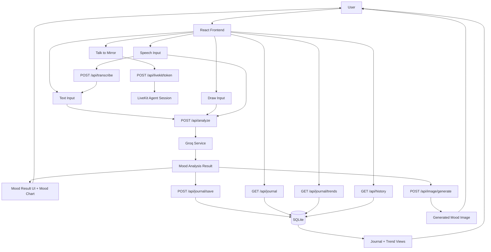

# AI Mood Mirror - Product Requirements Document

## Document Status
- Last updated: 2026-04-22
- Source of truth: current codebase and latest available test report artifacts
- Stage: working MVP+ prototype with advanced interaction features

## Product Vision
AI Mood Mirror is an emotional reflection app where visitors express themselves and receive an AI-powered mirror of their current mood. The product is designed for open, low-friction use: no signup, no profile setup, immediate interaction.

## Core Problem Statement
People often struggle to name or process emotions in the moment. The app provides a creative reflection loop:
1. User expresses mood through text, drawing, speech, or live voice conversation.
2. AI analyzes emotional signals and returns a concise response.
3. User can save reflections, review trends, and optionally generate visual mood art.

## Current Architecture
- Backend: FastAPI (Python), modular services layer
- Frontend: React 19, Tailwind-style utility classes, Framer Motion, Recharts
- Storage: local SQLite for analysis history and mood journal
- AI analysis: Groq chat-completions API (model configurable via environment variable)
- Optional AI image generation: dedicated image generation service endpoint
- Optional realtime voice mode: LiveKit token endpoint + agent process
- Speech transcription: Groq Whisper endpoint integration

## Mermaid Design Workflow

## Target Users
- General public, museum visitors, and curious users exploring emotional self-reflection
- Anonymous usage (no auth required in current version)
- English and German speakers

## Confirmed Implemented Scope (Current)

### Experience and Navigation
- [x] Landing page and app shell
- [x] Main mirror experience with dynamic visual mood background/orb
- [x] In-app navigation between Mirror, Journal, and History views

### Input and Analysis
- [x] Text mood input
- [x] Drawing mood input (image data analyzed by multimodal prompt flow)
- [x] Speech mood input with transcription before analysis
- [x] Talk to Mirror mode (realtime voice session flow via LiveKit when configured)
- [x] Mood analysis output with six tracked emotions:
  - happiness
  - sadness
  - stress
  - calmness
  - anger
  - curiosity
- [x] Dominant mood detection
- [x] Creative response types (poem, motivation, joke)
- [x] Language-aware responses in English and German

### Reflection and Tracking
- [x] Session history endpoint and UI list
- [x] Save analysis to mood journal with optional personal note
- [x] Journal list view and per-entry delete
- [x] Mood trend chart with 7/30/90-day filters
- [x] Aggregate mood stats derived from trend data

### Visual and Audio Layer
- [x] Ambient procedural background music control
- [x] Mood-reactive orb and immersive styling
- [x] AI mood image generation from analysis result
- [x] Generated mood image download in UI

### Internationalization
- [x] Full UI translation support for English and German
- [x] Localized labels for all major mirror and journal interactions
- [x] Language switcher in app header

### Platform and Deployment Readiness
- [x] Dockerfiles for frontend and backend
- [x] Docker Compose setup for local full-stack run
- [x] Render deployment configuration present
- [x] Backend CORS defaults for local dev origins

## API Surface (Current)
- `POST /api/analyze`
- `GET /api/history`
- `DELETE /api/history`
- `POST /api/journal/save`
- `GET /api/journal`
- `GET /api/journal/trends`
- `DELETE /api/journal/{entry_id}`
- `POST /api/image/generate`
- `POST /api/transcribe`
- `POST /api/livekit/token`
- `GET /api/` (API root)

## Non-Goals (Still Not Implemented)
- User authentication and multi-user isolation
- Cloud-synced persistent user accounts
- Subscription/billing logic
- Therapist sharing workflows
- PDF export and social share cards

## Known Constraints and Risks
- SQLite is local/single-instance oriented; not ideal for production multi-user scale
- Talk to Mirror requires valid LiveKit environment configuration
- Speech transcription requires Groq API key
- Image generation depends on configured image generation backend service
- Deployed ephemeral runtimes can lose SQLite data without persistent volume strategy

## Testing Status Snapshot
- Latest available report indicates full pass on covered backend and frontend scenarios, including multilingual flow, journal operations, speech/drawing paths, and core analysis loop
- Recommendation: add CI-based automated regression suite for talk mode and image generation failure paths

## Next Priority Backlog

### P1 (stability and productionization)
- Add environment/config validation screen and health diagnostics for optional services
- Introduce structured error states in UI for LiveKit/transcription/image dependencies
- Add automated integration tests for `/api/transcribe`, `/api/livekit/token`, and `/api/image/generate`

### P2 (user value)
- Export mood journal as PDF
- Shareable mood image/result card
- Additional language packs (French, Spanish)

### P3 (longer-term)
- Auth + cloud persistence migration (PostgreSQL)
- Personalized long-term AI memory
- Collaborative or shared mood sessions

